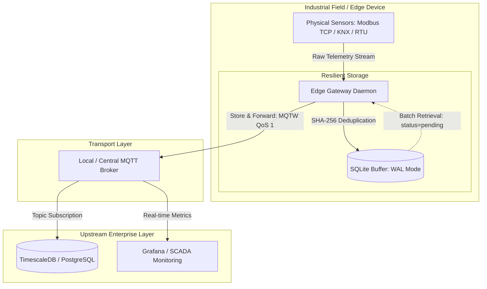

# Edge Gateway Blueprint for Industrial IoT (IIoT)

An enterprise-ready, fault-tolerant Edge Gateway blueprint designed for resilient sensor data ingestion, edge persistence, and telemetry dispatching under unstable network conditions.

---

## System Architecture



---

## Architectural Highlights

*`**Store & Forward Resiliency:** Continuous telemetry ingestion into an embedded local database buffer during communication blackouts, with automatic batch draining upon link restoration.
* **SQLite WAL (Write-Ahead Logging):** Eliminates database concurrency locks by separating sequential append writes from batch read synchronization pipelines.
* **QoS 1 Idempotency & Deduplication:** Prevents duplicated metric accumulation by computing deterministic SHA-256 payload hashes combined with `ON CONFLICT DO NOTHING`.
* **Containerized Workload:** Isolated daemon deployment orchestrated alongside Mosquitto MQTT broker via Docker Compose.

---

## Quickstart

### 1. Build and Run
```bash
docker compose up -d --build
```

### 2. Stream Live Gateway Logs``bash
docker compose logs -f edge-gateway
```

### 3. Monitor MQTT Ingestion
``bash
docker exec -it edge_mqtt_broker mosquitto_sub -t "industrial/telemetry" -v
```

---

## License
MIT License.
